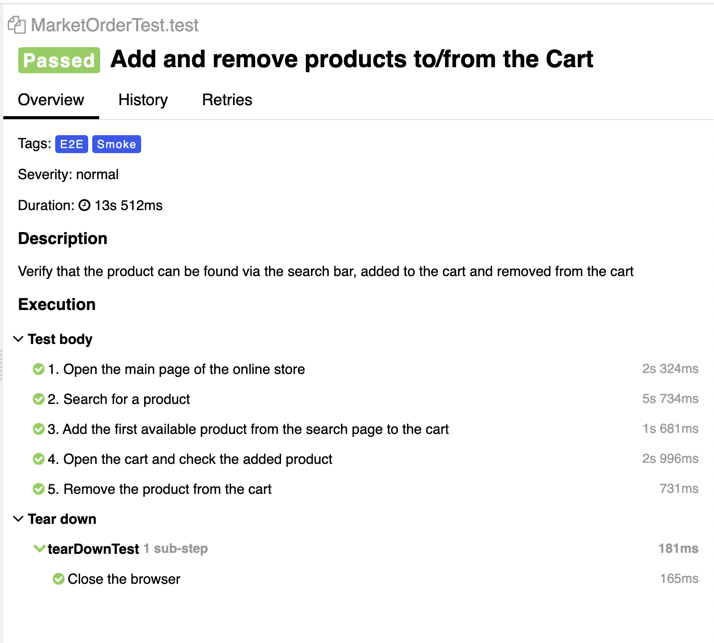

### Test automation demo example using Selenium WebDriver + JUnit 5

There's an example test with a following flow:
1. Open the main page for the online store
2. Search for a product
3. Add it to the cart
4. Remove it from the cart and check that the cart is empty

[Yandex.Market](https://market.yandex.ru/) is selected as the SUT (system under test).

Stack in use:
* **Selenium WebDriver 3**: web browser interactions
* **JUnit 5**: test runner, assertions
* **Allure**: test reporting

#### Resulting test report using Allure library
